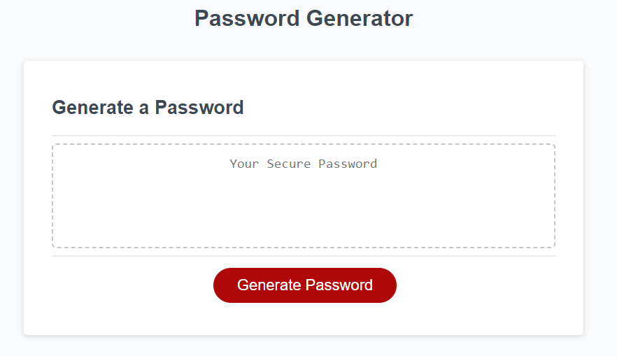

# Password Generator

## Overview

This web application is designed for employees to generate random passwords based on specific criteria they select. The app runs in the browser and features dynamically updated HTML and CSS, all powered by JavaScript code. The user interface is clean, polished, and responsive, ensuring adaptability to various screen sizes.

## Preview



## Link to the Deployed Application

[https://volodymyr-shtyka.github.io/passphrase-maestro/](https://volodymyr-shtyka.github.io/passphrase-maestro/)

## Instructions

1. **Clone the Repository:**
    - Clone the repository to your local machine using the following command:
      ```
      git clone git@github.com:Volodymyr-Shtyka/passphrase-maestro.git
      ```
      
2. **Navigate to the Project Directory:**
    - Change into the project directory:
      ```
      cd passphrase-maestro
      ```

2. **Open the Index.html File:**
    - Open the `index.html` file in a web browser to view and interact with the password generator.

3. **Generate Password:**
    - Click the "Generate Password" button to initiate the password generation process.

4. **Password Criteria:**
    - The app will prompt you for the following criteria:
        - **Length of Password:**
            - Enter a value between 8 and 128 characters.
        - **Character Types:**
            - Choose one or more of the following character types:
                - Lowercase
                - Uppercase
                - Numeric
                - Special characters ($@%&*, etc.)

5. **Validation:**
    - The code will validate each input to ensure it meets the specified criteria.
    - At least one character type must be selected.

6. **Password Generation:**
    - Once all prompts are answered and validated, the password will be generated.

7. **Display Password:**
    - The generated password will be displayed in an alert or written to the page.

## Code Structure

- **index.html:** Main HTML file providing the structure of the password generator.
- **style.css:** CSS file styling the appearance of the password generator.
- **script.js:** JavaScript file containing the logic for password generation and user interaction.

## Notes

- The code ensures a responsive design, adapting to various screen sizes.
- Validation is in place to guarantee a secure and valid password generation process.

Feel free to explore, modify, and enhance the code to meet your preferences while ensuring the core functionality remains intact. If you have any questions or need further assistance, refer to the code comments or documentation provided in the starter code.
